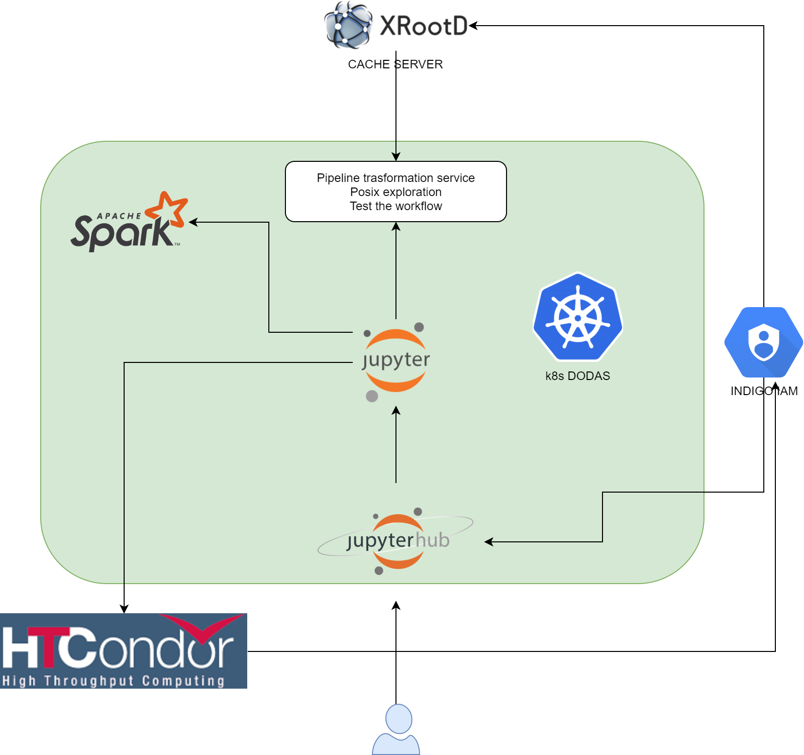

# INFN Analysis Facility

## The purpose
Often, in order to perform their analysis, particle physicists have to use resources shared between the whole research community, which in many cases results in inefficiency and bad user experience, along with limited access to specialized hardware and software. Here we present a prototype of Analysis Facility whose aim is to provide analysts a straightforward access to a Python-based scalable computational environment (focusing on columnar analysis) that can be deployed on-demand, allowing access to specialized hardware as well. Kubernetes clusters are used to host necessary services, which include Jupyterhub and a batch system (HTCondor). Security is ensured by OAuth 2.0 authentication, while the on-demand deployment is allowed by DODAS helm charts. Although presented as a CMS experiment use case, this tool uses a general-purpose approach, allowing researchers from different experiments to share the same local resources.

## The architecture
This repo contains all information and recipes to set up an Analysis Facility either on your own ks8s cluster or on INFN Cloud infrastructure. 



As shown in the figure above, users get access to a Jupyer Notebook instance authenticating at Jupyterhub endpoint via INDIGO-IAM provider. Here, they can perform analysis locally (also  spawning and exploiting Spark workers) or submitting jobs via Dask to an HTCondor batch system (also instantiated on k8s). 

We will provide you with two different user guides: one for deployment instructions (admins), and another one focused on how to utilize the stack (users). 
## User Guide

### Requirements
- a web access via browser (for Jupyter Notebook)
- a Docker Desktop installation (for HTCondor standalone client). 
- setup oidc-agent for CMS (https://github.com/ttedeschi/INFN-analysis-facility/blob/main/oidc-token-cms.md).  You first have to apply for a CMS-IAM account at https://cms-auth.web.cern.ch/ 

### Access to Jupyter Notebook

Go to the endpoint address that your admin will provide and authenticate via Dodas-IAM, choosing the resources that will be assigned to your notebook. Once you have done this, you will be able to run multiple Jupyter notebooks, where you can perform your analysis or that you can use to submit jobs to HTCondor.

### Direct access to HTCondor via client
In order to access HTCondor cluster for submission, you need an HTCondor client (a smooth way to obtain it is to setup an HTCondor client using ```htcondor/submit:8.9.9-el7``` image via Docker Desktop but a local installation of HTCondor client could work as well). 

TEMPORARY SOLUTION: ask your cluster admin for a CA certificate and write it into ```/ca.cert``` file. Besides, ```oidc-token cms``` to get a valid token and put it into ```/tmp/token``` file. 

Once you have done these two steps, set these environment variables:
```
export _condor_AUTH_SSL_CLIENT_CAFILE=/ca.crt
export _condor_SEC_DEFAULT_AUTHENTICATION_METHODS=SCITOKENS
export _condor_SCITOKENS_FILE=/tmp/token                          # token from CMS-IAM
export _condor_COLLECTOR_HOST=<k8s_master_public_ip>.xip.io:<k8s_master_open_port>
export _condor_SCHEDD_HOST=<name_of_cheduler>
export _condor_TOOL_DEBUG=D_FULLDEBUG,D_SECURITY
```
Here, ```<k8s_master_public_ip>```, ```k8s_master_open_port``` and ```<name_of_cheduler>``` have to be substituted with admin-provided values.

Now you are good to go!

## Admin guide 

### Requirements
- A k8s cluster with a Helm3 installation.

### Setup Jupyterhub

Log into the cluster and add Dodas Helm charts to Helm repos
```
helm repo add infnAF https://ttedeschi.github.io/INFN-analysis-facility/helm-charts
helm repo update
```
then subsitute in ```helm-charts/jupyterhub/values.yaml``` k8s master public IP and deploy Jupyterhub:
```
helm install infnAF/jupyterhub --values helm-charts/jupyterhub/values.yaml --generate-name --kubeconfig /etc/kubernetes/admin.conf
```

### Setup htcondor

Log into the cluster, install a storage system and a cert-manager:
```
helm repo add longhorn https://charts.longhorn.io
helm repo update
kubectl create namespace longhorn-system
helm install longhorn longhorn/longhorn --namespace longhorn-system --kubeconfig /etc/kubernetes/admin.conf
kubectl create namespace cert-manager
helm repo add jetstack https://charts.jetstack.io
helm repo update
helm install cert-manager jetstack/cert-manager --namespace cert-manager --version v1.1.0 --set installCRDs=true --kubeconfig /etc/kubernetes/admin.conf
```
After substituting <k8s master public ip> with the real value inside ```helm-charts/jupyterhub/values.yaml```, create the htcondor deployment
```
helm repo add infnAF https://ttedeschi.github.io/INFN-analysis-facility/helm-charts
helm repo update
helm install infnAF/jupyterhub --values helm-charts/jupyterhub/values.yaml --generate-name --kubeconfig /etc/kubernetes/admin.conf
```
HTCondor components use PASSWORD authentication method using a shared secret across the cluster.

### Get CA certs for clients

HTCondor clients outside the cluster use a SCITOKENS authentication method, using CMS-IAM token. CA certs can be retrieved with
```
kubectl exec schedd-pod-<pod name here> cat /etc/certs/ca.crt
```
